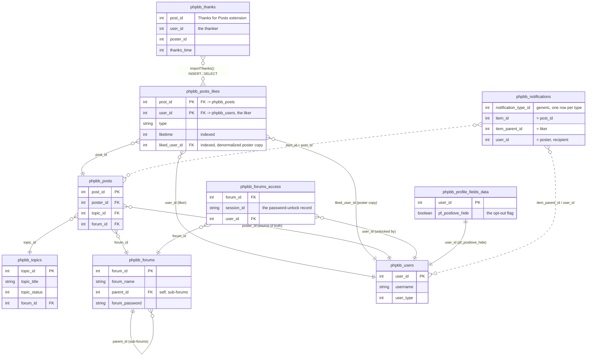

# Post Love Extension — Database Schema

The extension's own table is `phpbb_posts_likes`. Everything else here is a
core phpBB table (or, for `phpbb_thanks`, another extension's table) that
Post Love reads from or writes to. Columns are abbreviated to what Post Love
actually touches — see the linked source for the full column list of any
core table.

## Notes

- **`liked_user_id`** is a denormalized snapshot of `phpbb_posts.poster_id`,
  backfilled once by `release_2_0_0_add_liked_user_id` so "likes received"
  counts don't need a join to `phpbb_posts`. It is kept in sync by
  `main_listener::clean_users_after()` on `core.delete_user_after`, and
  reconciled by the ACP's repair tool (`acp_postlove_module::cleanPostLoves()`)
  for any rows that predate that listener.
- **`phpbb_forums_access`** is what `service\forum_access::drop_locked()`
  checks before showing anything derived from a forum's contents — `f_read`
  is granted independently of a forum password, so it alone is not enough to
  know whether the viewer may actually see the forum.
- **`phpbb_thanks`** is not a live foreign key relationship — `importThanks()`
  runs a one-off `INSERT ... SELECT` from it into `phpbb_posts_likes`, guarded
  by `sql_table_exists()` since the Thanks for Posts extension may not be
  installed.
- **`phpbb_notifications`** is a generic, polymorphic core table shared by
  every notification type. phpBB dedupes by `(notification_type_id, item_id)`
  alone, so a liked post has at most one notification row, owned by whoever
  liked it first — see `notifyhelper::notify()`.
